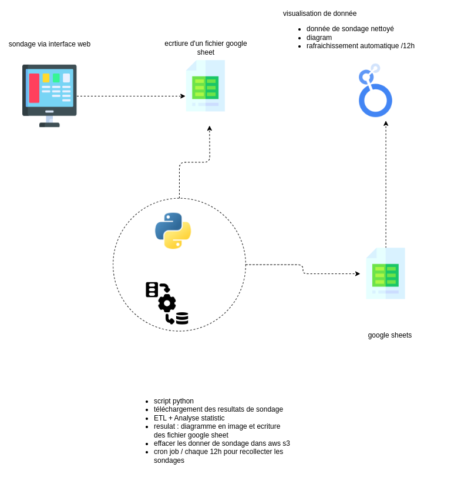

# Data Marketing ETL Project

Ce projet est un pipeline ETL (Extract, Transform, Load) conçu pour traiter et analyser les données de sondage. Il inclut des étapes de nettoyage, d'analyse statistique et de visualisation des données, avec des résultats exportés vers Google Sheets.

## Structure du projet

- **`etl.ipynb`** : Script principal contenant le pipeline ETL.
- **`clean_data.csv`** : Fichier CSV contenant les données nettoyées.
- **`sondage.xlsx`** : Fichier Excel contenant les données brutes de sondage.
- **`architecture.drawio`** : Diagramme décrivant l'architecture du projet.
- **`.env`** : Fichier contenant les variables d'environnement.
- **`secret.json`** et **`sheet_secret.json`** : Fichiers de configuration pour l'accès aux services externes (Google Sheets, AWS S3).

## Fonctionnalités principales

1. **Extraction** :
   - Téléchargement des données de sondage depuis AWS S3.

2. **Transformation** :
   - Nettoyage des données :
     - Suppression des lignes/colonnes vides.
     - Renommage des colonnes (remplacement des espaces par des underscores, conversion en minuscules).
     - Suppression des doublons.
     - Ajustement des prix et des quantités.
   - Conversion des données en DataFrame avec `pandas`.

3. **Chargement** :
   - Export des données nettoyées vers un fichier CSV (`clean_data.csv`).
   - Écriture des résultats dans Google Sheets.

4. **Automatisation** :
   - Vidage des fichiers de sondage après traitement.
   - Planification via un cron job pour exécuter le pipeline toutes les 12 heures.

## Diagramme d'architecture

Voici le schéma de l'architecture du pipeline ETL utilisé dans ce projet :

<div style="background-color: white; padding: 10px; display: inline-block;">
  
</div>


## Dépendances

Les dépendances nécessaires sont installées via la commande suivante (présente dans le notebook) :

```bash
pip install boto3 pandas openpyxl xlrd gspread oauth2client


